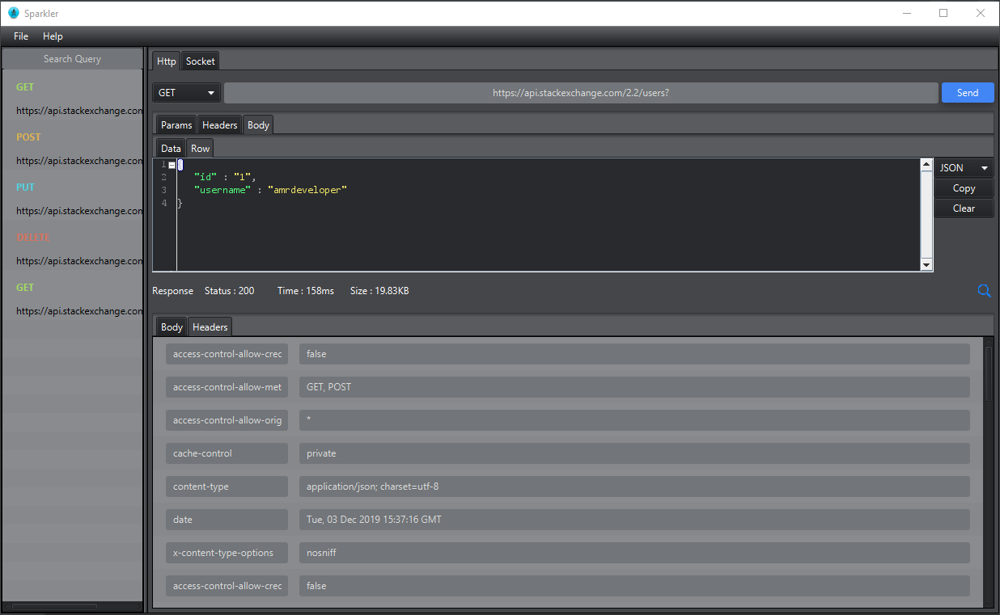

# Sparkler
 
Cross platform API request builder to make HTTP with different methods and WebSocket connection and you can send and receive data 

## Dependencies
- OkHttp 3.8.1
- Socket.IO Client 1.0.0
- JFoenix 8.0.0
- RsyntaxTextArea 3.0.4

## Features
- Create HTTP request with different method GET, POST, DELETE, PUT, PATCH
- Support to add Body, Header, Params in Request
- Create WebSocket Connection and send and receive data
- Create Socket IO Event Listeners to listen to event with name
- Request history list to resend requests from history
- Dark and White theme
- Format response body in different languages
- Text Editor for response body and support multi languages highlighter and code folding
- Search in response body and highlight all matches result
- Copy or clear text with simple one click
- Can change request timeout connection, read and write data
- Support Cross Platform

## Screenshots
 